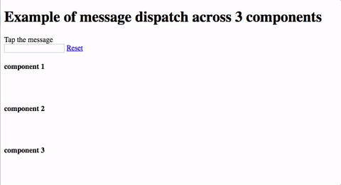

# reactReduxExample

##Example for use redux with react

Here is an example of using redux with React
The message typed in the input element is dispatched via redux and updated in the 3 components at the same time.

```
npm install
npm run dev
open http://localhost:8080/
```


